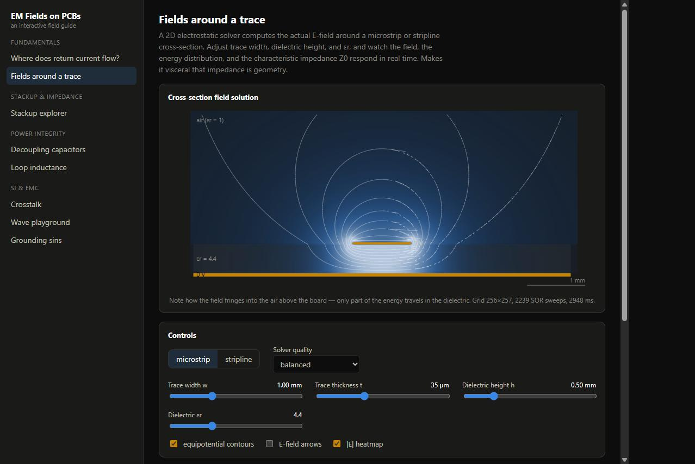
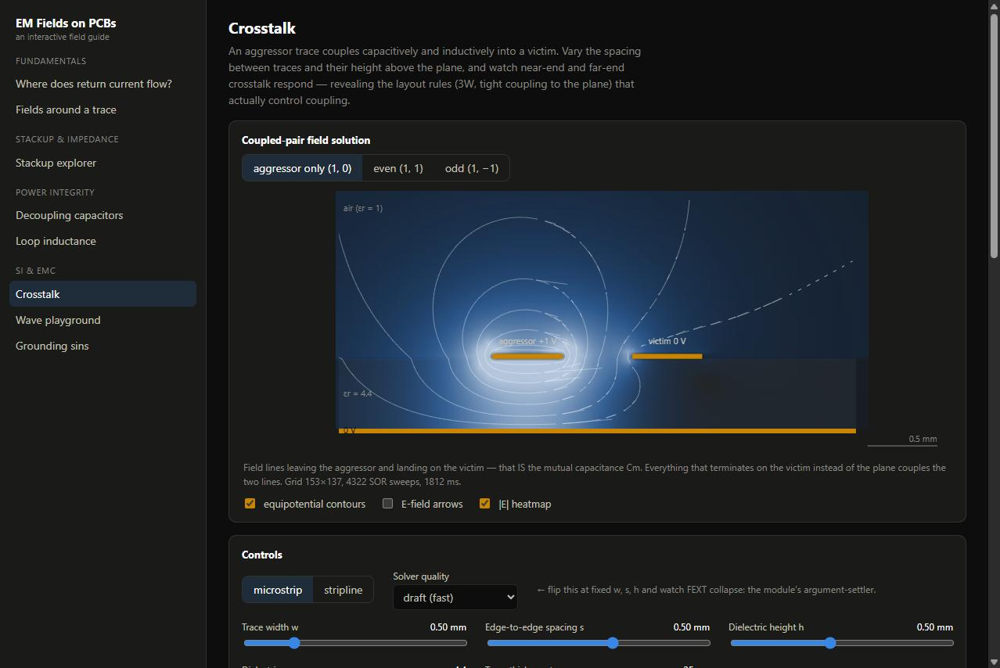
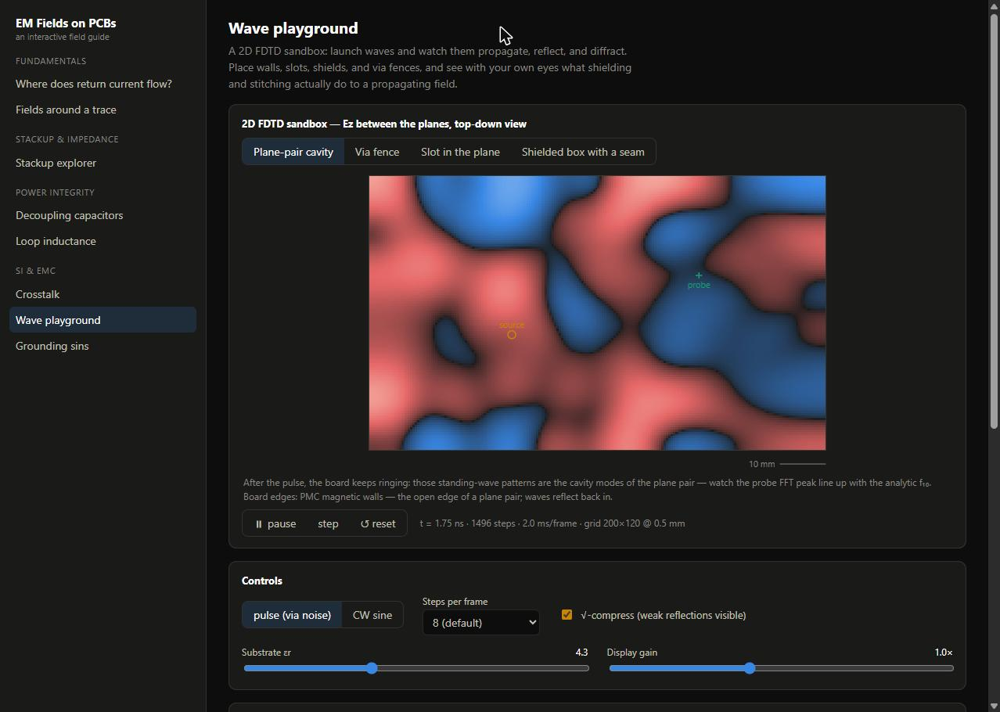
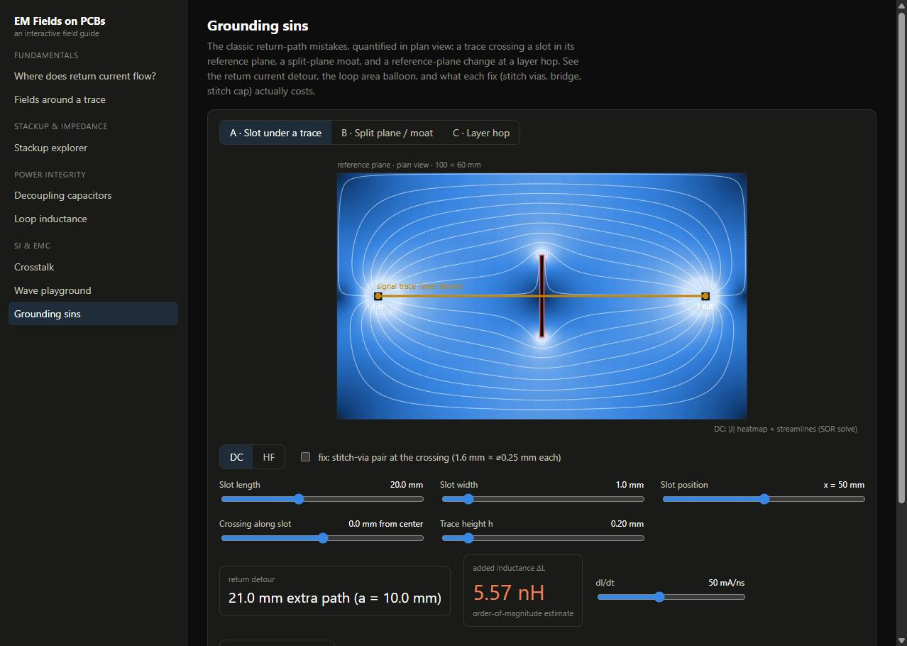
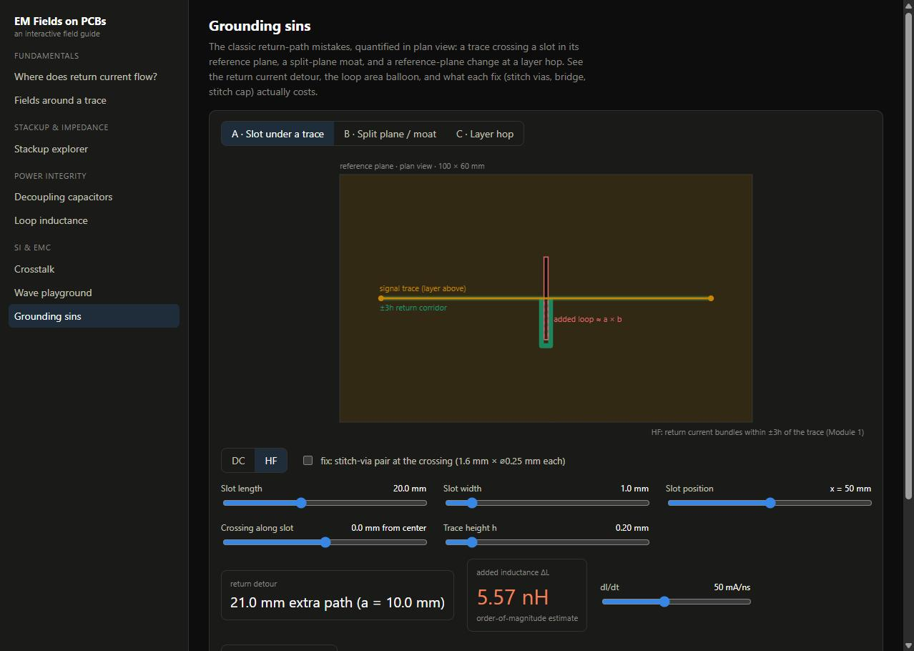
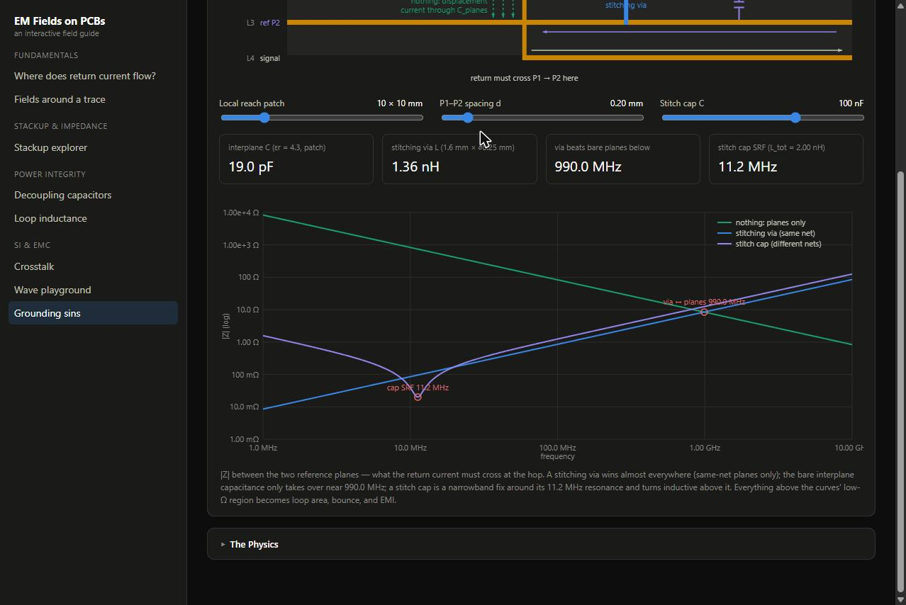

# EM Fields on PCBs — an interactive field guide

**Live: <https://gonnie2219.github.io/em-fields-pcb/>**

An interactive web app that teaches how electromagnetic fields actually behave on
printed circuit boards. Every rule of thumb in high-speed layout — "keep the return
path solid", "decouple at the pin", "don't cross splits" — is a statement about
fields, and every module here lets you *watch* those fields respond to sliders in
real time: live 2D solvers, honest closed forms, and plots annotated with the layout
rules they justify. Built for EE students meeting signal integrity for the first
time and practicing engineers who want the physics behind the folklore.



## The eight modules

| # | Module | The physics hook |
|---|--------|------------------|
| 1 | **Where does return current flow?** | HF return current crowds under the trace as J(x) = I/(πh)·1/(1+(x/h)²); at DC it spreads plane-wide — one distribution morphing into the other with frequency. |
| 2 | **Fields around a trace** | A finite-volume ∇·(ε∇φ) = 0 solver (red-black SOR) computes the real E-field and Z₀ of a microstrip/stripline cross-section as you drag the geometry. |
| 3 | **Stackup explorer** | The same solver scores 2/4/6-layer stackups: field containment, return corridors, and the "free" interplane capacitance a tight P–G pair buys. |
| 4 | **Decoupling capacitors** | A real capacitor is a series RLC: self-resonance, ESR/ESL, and the anti-resonance peaks that appear when different values share a rail. |
| 5 | **Loop inductance** | Inductance belongs to loops, not wires — Rosa/Grover partial-inductance sums show why loop *area* is the number one quantity in layout. |
| 6 | **Crosstalk** | Even/odd-mode field solves give Cm/Cs and Lm/Ls, then closed-form NEXT/FEXT show why 3W and thin dielectrics actually work. |
| 7 | **Wave playground** | A 2D FDTD sandbox (Yee grid, Mur ABC): watch pulses reflect, diffract through slots, ring plane cavities, and get stopped — or not — by via fences. |
| 8 | **Grounding sins** | Slot-under-trace, split-plane moats, and layer hops, each with its return-path detour quantified in nH (Grover rectangle) and its fix priced honestly. |

## A tour in pictures

Coupled-pair field solution — the mutual capacitance of Module 6 is literally the
field lines landing on the victim:



The FDTD wave playground ringing a plane-pair cavity (the standing-wave pattern's
FFT peak lands on the analytic f₁₀):



Module 8's DC/HF contrast: at DC the plane current spreads everywhere and shrugs
off a slot…



…while at HF the same slot forces the ±3h return corridor around its end — the
shaded rectangle is new loop area, priced in nanohenries:



And the layer-hop return impedance — stitching via vs. bare interplane capacitance
vs. stitch cap, crossovers annotated:



## Physics honesty

This tool tries hard not to hand-wave:

- **Every physics function is cited.** All physics lives in `src/physics/` as pure
  TypeScript with JSDoc naming the formula and its source — Rosa 1908, Grover 1946,
  Hammerstad–Jensen 1980, Cohn's exact stripline solution, Johnson & Graham 1993,
  Hall & Heck 2009, Yee 1966 / Taflove & Hagness, Smith et al. 1999 — with SI units
  on every parameter.
- **Every function has a validation anchor.** The 105-test Vitest suite checks
  against known reference values (skin depth of Cu ≈ 66 µm at 1 MHz, a 10 cm square
  loop = 361.9 nH, Z₀ within 5 % of Hammerstad–Jensen and 3 % of Cohn, FDTD cavity
  f₁₀ within 3 % of analytic, …), not just self-consistency — and the CI deploy is
  gated on the suite staying green.
- **Approximations are declared, not buried.** Every module has a collapsible
  "The Physics" panel stating the model, the governing equations, and an explicit
  list of assumptions; pedagogical estimates are labeled as such right in the UI
  (e.g. Module 8's detour inductance is flagged order-of-magnitude, and Module 5
  shows where its mounting-loop model disagrees with folk presets instead of tuning
  the gap away).

## Run it locally

```bash
npm install
npm run dev     # dev server
npm test        # 105-test physics + render suite
npm run build   # static site in dist/
```

**Stack:** Vite + React + TypeScript (strict), Canvas 2D, KaTeX, Web Workers for the
SOR and FDTD solvers, Vitest. No backend — builds to a fully static site.

**License:** [MIT](LICENSE)
